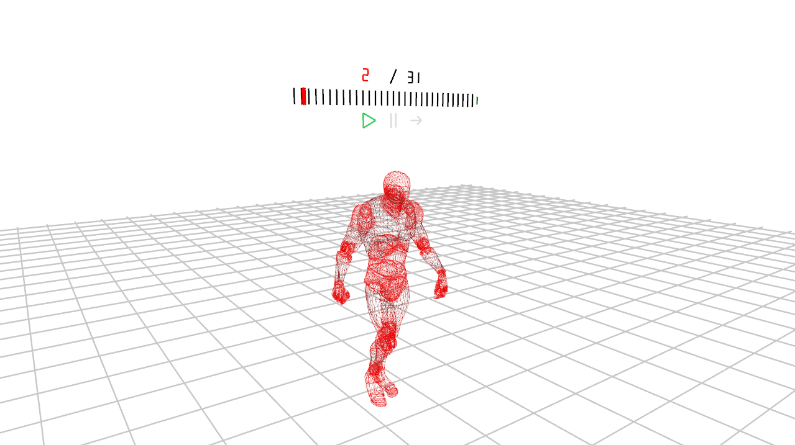

# AnimationProgramming

## What is this project about ?
This project is a school project made in 5 days during my studies at ISART Digital. My goals for this project are:
- Learning how 3D animation (Skeletal animation in particular) can get implemented in a game engine
- Understanding how to compute a 3D Animation using the CPU and the GPU (Hardware skinning)
- Improving my skills in project architecture
- Getting better at producing high-quality code (Well commented and easy to read as much as possible)
- Having fun doing what I like

## Software used
- Visual Studio 2017 to code

## Libraries used
- WhiteBoxEngine (3D Engine made by a professor at ISART Digital: https://github.com/Trizek/WhiteBoxEngine)
- GLEW to manipulate the OpenGL over the WhiteBoxEngine (Which uses SDL as window and rendering context)
- Windows for input handling
- AltMath (Mathematic library made in collaboration with my classmates)
- GyvrIni (My personal ini library)

## Target platforms and configurations
For this project I target Windows (32 bits only) because of my use of Windows.h for inputs handling

## How to build ?
The build isn't included in this repository. To build this project, the best and easiest way is to use Visual Studio 2017. All you have to do is to build in any configuration you want (Debug/Release) but for 32 bits platform exclusively (Due to WhiteBoxEngine compatibility).
A "Build/" folder will be generated at the root of the repository, ready for you to play with!

## Direct Download
- [Windows - 32/64-bit](http://adrien-givry.com/download/animation-programming.zip)

## Technical Demonstration
- [Youtube Link](https://youtu.be/PzjegVRmqRU)
